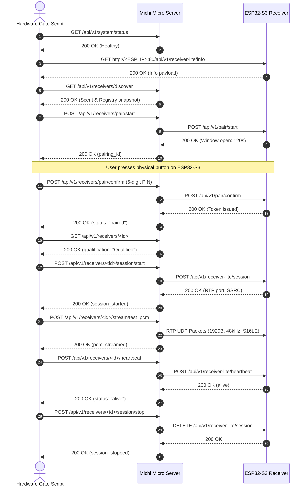

# Michi ESP32-S3 Physical Hardware Certification Gate Protocol

This document defines the strict certification procedure for physical ESP32-S3 receivers running the `receiver-v1-lite` firmware.

## 1. Canonical Network & Protocol Contract

| Parameter | Canonical Value | Description |
|---|---|---|
| **Whisker Multicast** | `224.0.0.167:53318` | UDP multicast discovery announcements |
| **Interface Binding** | `192.168.31.224` (`enp7s0`) | Host adapter IP (`MICHI_WHISKER_IFACE_IP`) |
| **Receiver HTTP Port** | `80` | ESP32-S3 HTTP control plane (NOT 8080) |
| **Pairing Window TTL** | `120 seconds` | Time allowed to confirm physical pairing |
| **PIN Constraint** | `/^\d{6}$/` | Exactly 6 numeric ASCII digits |
| **Audio Transport** | `rtp_udp` | Raw RTP over UDP, 1920-byte payload chunks |
| **Audio Codec** | `pcm_s16le` | 16-bit signed little-endian PCM |
| **Sample Rate** | `48000 Hz` | Standard canonical sample rate |
| **Channels** | `2` (Stereo) | 4 bytes per stereo frame |

## 2. Architecture & Design Principles

The hardware certification gate **does not** reimplement cryptography or session protocols in Bash. Instead, it exercises the **real Michi Micro Server APIs**:
- Michi Micro Server manages the Ed25519 handshake, Diffie-Hellman ephemeral secrets, Chacha20-Poly1305 credential storage, and Perch authority tokens.
- The gate script acts as a test orchestrator against Micro's HTTP REST endpoints.
- **Fail-closed execution**: Every step checks exact HTTP response status codes and validates response JSON payloads. Any unexpected status terminates execution immediately.

## 3. Step-by-Step Test Sequence



## 4. Execution Guide

```bash
# 1. Start Michi Micro Server with physical interface binding:
export MICHI_WHISKER_IFACE_IP=192.168.31.224
cargo run --bin michi-server

# 2. In another terminal, run the physical hardware gate:
./scripts/esp32_hardware_gate.sh <ESP32_IP> <6_DIGIT_PIN> http://127.0.0.1:3000
```
