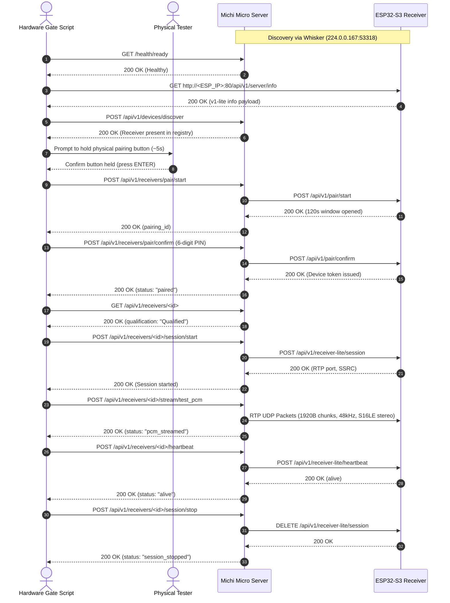

# Michi ESP32-S3 Physical Hardware Certification Gate Protocol

This document defines the strict physical hardware qualification procedure for ESP32-S3 audio receivers running the `receiver-v1-lite` firmware.

## 1. Canonical Network & Protocol Contract

| Parameter | Canonical Value | Description |
|---|---|---|
| **Whisker Multicast** | `224.0.0.167:53318` | UDP multicast discovery announcements |
| **Interface Binding** | `192.168.31.224` (`enp7s0`) | Host adapter IP (`MICHI_WHISKER_IFACE_IP`) |
| **Micro Server URL** | `http://127.0.0.1:9090` | Default Michi Micro Server HTTP base URL |
| **Receiver HTTP Port** | `80` | ESP32-S3 HTTP control plane (NOT 8080 or 3000) |
| **Pairing Window TTL** | `120 seconds` | Time allowed to confirm physical pairing |
| **PIN Constraint** | `/^\d{6}$/` | Exactly 6 numeric ASCII digits |
| **Audio Transport** | `rtp_udp` | Raw RTP over UDP, 1920-byte payload chunks |
| **Audio Codec** | `pcm_s16le` | 16-bit signed little-endian PCM |
| **Sample Rate** | `48000 Hz` | Canonical sample rate |
| **Channels** | `2` (Stereo) | 4 bytes per stereo frame |

## 2. Architecture & Design Principles

The hardware certification gate **does not** reimplement cryptography or session protocols in Bash. Instead, it exercises the **real Michi Micro Server APIs**:
- Michi Micro Server manages the Ed25519 handshake, Diffie-Hellman ephemeral secrets, ChaCha20-Poly1305 credential storage, and Perch authority tokens.
- The gate script acts as a test orchestrator against Micro's HTTP REST endpoints.
- **Fail-closed execution**: Every step checks exact HTTP response status codes and validates response JSON payloads. Any unexpected status terminates execution immediately.
- **Audio Verification Route**: The test PCM endpoint (`POST /api/v1/receivers/:id/stream/test_pcm`) is protected by the `hardware-gate` Cargo feature flag in `michi-api`. Server builds intended for physical gate certification must include `--features hardware-gate`.

## 3. Sequence Diagram



## 4. Execution Guide

### Prerequisites
1. **Physical Network**: Connect the host machine and ESP32-S3 to the same subnet (e.g., `192.168.31.0/24`).
2. **Interface Binding**: Bind the host interface IP for Whisker multicast reception (`export MICHI_WHISKER_IFACE_IP=192.168.31.224`).
3. **Compilation**: Build and run `michi-server` with `--features hardware-gate`:
   ```bash
   export MICHI_WHISKER_IFACE_IP=192.168.31.224
   cargo run --bin michi-server --features hardware-gate
   ```

### Running the Hardware Gate
In another terminal, run:
```bash
./scripts/esp32_hardware_gate.sh <ESP32_IP> http://127.0.0.1:9090 <6_DIGIT_PIN>
```
*Note: If `PIN` is omitted, the script will prompt interactively during Phase 5.*

