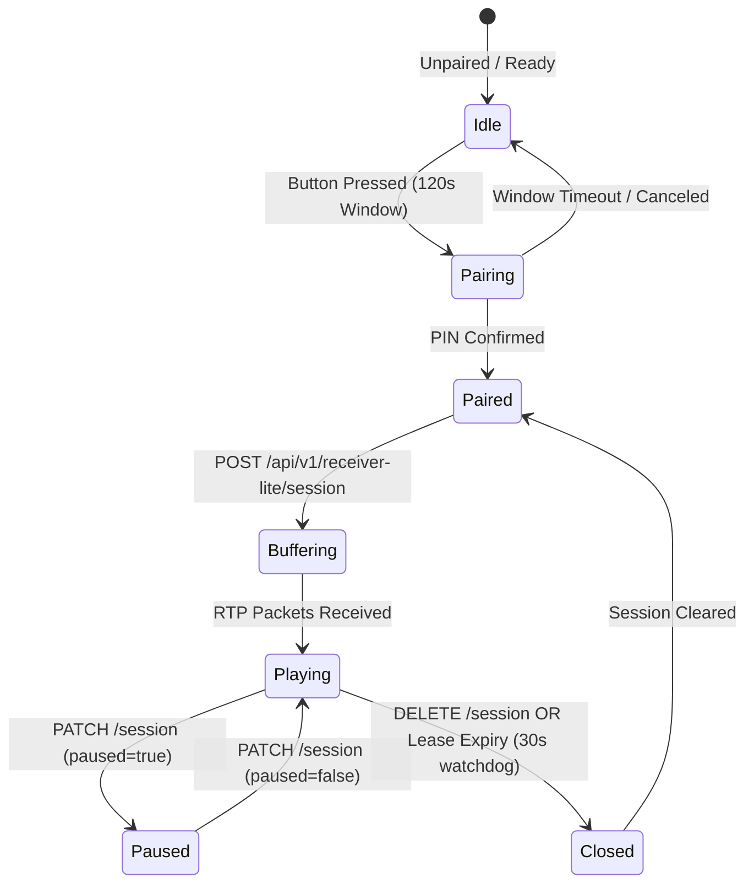

# Michi Link v1-lite — Compatibility & Protocol Governance

This document defines the strict compatibility contract between Michi Link clients and receivers.

---

## 1. Discovery & Identity Scheme

- **Service Type**: `_michi-link._tcp`
- **Identity Scheme**: `ed25519-blake3-v1`
- **Fields**:
  - `server_id`: UUIDv4 identifier
  - `michi_id`: BLAKE3 hash of Ed25519 public key (base64url without padding)
  - `public_key`: Ed25519 public key in base64url
  - `version`: Firmware / software version string
  - `api_version`: `v1-lite`

---

## 2. Pairing Contract

Pairing follows a strict cryptographic and physical challenge workflow:
1. Physical button push opens a 120-second pairing window on the receiver.
2. Controller sends `POST /api/v1/pair/start` containing controller identity and challenge nonce.
3. Receiver returns `session_id` (UUIDv4) and presents a 6-digit PIN on its 320x240 landscape display.
4. Controller sends `POST /api/v1/pair/confirm` with `session_id` and `pin`.
5. Receiver validates PIN (max 5 failed attempts) and returns a permanent 32-byte CSPRNG token (base64url encoded).

---

## 3. Receiver Audio Session Lifecycle



---

## 4. Error Taxonomy & Status Codes

All errors follow the standard JSON error envelope:
```json
{
  "error": {
    "code": "ERROR_CODE",
    "message": "Human readable message",
    "details": {}
  }
}
```

Standard Error Codes:
- `UNAUTHENTICATED` (401): Missing or invalid Bearer token.
- `INVALID_REQUEST` (400): Schema or parameter validation failure.
- `SESSION_CONFLICT` (409): Active session already in progress.
- `SESSION_NOT_FOUND` (404): Session has expired or been terminated.
- `UNSUPPORTED_FORMAT` (400): Requested sample rate or codec exceeds certified capabilities.
