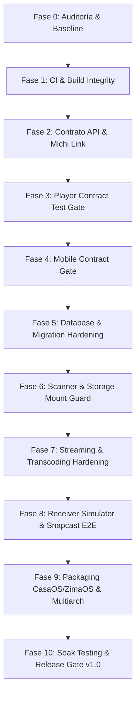

# Michi Micro Server — Auditoría de Estabilización hacia v1.0.0

## Executive Summary

Michi Micro Server se encuentra en transición desde la fase de desarrollo activo (**v0.2.0**) hacia su primera versión de producción estable (**v1.0.0 Stable**). El repositorio cuenta con una base arquitectónica en Rust organizada en un workspace modular (1 binario principal y 21 crates).

Esta auditoría establece la línea base técnica (*baseline*), diagnostica discrepancias en CI/CD, evalúa la cobertura de pruebas, cataloga los tests ignorados, revisa contratos de API y define la hoja de ruta hacia el *Release Gate* de la versión v1.0.0.

---

## 1. Arquitectura Actual y Componentes

### 1.1 Estructura del Workspace (`Cargo.toml`)
- **Binario**: `apps/michi-server` (orquestación del servidor, inicialización de dependencias, supervisor/watchdog de workers en segundo plano).
- **Crates Core**:
  - `michi-core`: Modelos de dominio (`Track`, `AudioMetadata`, `AudioFormat`, `LibraryStats`), validación estricta de rutas de archivos (`is_path_inside_library`) y generación determinista de UUID v5 relativos a la raíz de la biblioteca.
  - `michi-api`: Router HTTP Axum 0.7, endpoints `/api/*` y `/api/v1/*`, middlewares de autorización RBAC/Tokens, sincronización vía WebSockets y entrega estática de la Web UI / PWA.
  - `michi-config`: Carga de configuración desde variables de entorno y perfiles de recursos (*Eco*, *Balanced*, *Performance*).
  - `michi-db`: Capa de persistencia en SQLite con SQLx (35 migraciones de esquema completadas).
  - `michi-metadata`: Extracción y parseo de tags de audio mediante el crate `lofty`.
  - `michi-scanner`: Indexador de archivos de audio con tolerancia a fallos, omisión de symlinks y protección de rutas.
  - `michi-streaming`: Servidor de streaming de audio con soporte de `HTTP Range Requests` y transcodificación opcional con FFmpeg.
  - `michi-sync`: Replicación y sincronización de estado de reproducción y colas entre instancias Michi.
  - `michi-link`: Protocolo de emparejamiento con dispositivos cliente (códigos PIN de 6 dígitos, códigos QR y tokens criptográficos).
  - `michi-receivers`: Capa de abstracción de clientes receptores de audio y sesiones de reproducción remota.
  - `michi-rooms`: Orquestación multi-habitación sincronizada con Snapcast mediante JSON-RPC.
  - `michi-opensubsonic`: Capa de compatibilidad con la API Subsonic/OpenSubsonic para interoperabilidad con clientes de terceros.
  - `michi-security`: Rate limiting por token bucket (`governor`), claves de idempotencia para mutaciones y validación de entradas.
  - `michi-ingest`: Ingesta de transmisiones externas (Radio Web, Podcasts RSS/Atom, HLS) con filtro SSRF para rangos IP privados/reservados.
  - `michi-identity`: Generación y almacenamiento de llaves Ed25519 cifradas con ChaCha20-Poly1305 AEAD.
  - `michi-connect`: Anuncio de servicios mDNS (`_michi._tcp`) y esquemas `michi://connect`.
  - `michi-homeassistant`: Integración con Home Assistant mediante broker MQTT.
  - `michi-m3u`: Parser e importador/exportador de listas de reproducción M3U/M3U8.
  - `michi-tui`: Interfaz de terminal interactiva con `ratatui`.
  - `michi-client`: SDK cliente en Rust para conectar con servidores Michi.
  - `michi-onboard`: Asistente de configuración inicial (*setup wizard*).

---

## 2. Estado de Madurez y Calidad de Código

### 2.1 Inspección Estática de Código
- **TODO / FIXME / HACK / XXX**: 0 ocurrencias detectadas en código de producción de los crates.
- **`unimplemented!` / `todo!`**: 0 ocurrencias en código de producción.
- **`panic!` en código de producción**: 0 ocurrencias (las llamadas a `panic!` están estrictamente restringidas a aserciones en suites de pruebas unitarias).
- **Manejo de Errores**: Uso consistente de `thiserror` para enums de error tipados por crate y `anyhow::Result` en capas de orquestación binaria.
- **Rust Toolchain**: Se incorpora `rust-toolchain.toml` con canal `stable` y componentes `rustfmt`, `clippy`.

---

## 3. Estado de CI y Suites de Pruebas

### 3.1 Resultados del Baseline Local
- `cargo fmt --check`: **PASS** (100% formateado según guía oficial de Rust).
- `cargo check --workspace`: **PASS** (0 errores, compilación limpia).
- `cargo test --workspace`: **PASS** (217 tests aprobados en tests unitarios e integrados de crates).
- `cargo clippy --workspace --all-targets -- -D warnings`: **PASS** (0 warnings bajo `-D warnings`).
- `docker build`: **PASS** (construcción exitosa en imagen multi-stage).

### 3.2 Inventario de Tests Ignorados (`#[ignore]`)
Se identificaron 14 tests marcados como `#[ignore]` en `crates/michi-receivers/tests/receiver_simulator_integration.rs`:

| Test | Crate | Razón | Dependencia | Severidad | Plan v1 |
| :--- | :--- | :--- | :--- | :--- | :--- |
| `test_receiver_info_standard` | `michi-receivers` | Requiere simulador receptor en puerto 8080 | `receiver_sim.py` | P1 | Integrar simulador en suite E2E de CI |
| `test_receiver_info_hifi` | `michi-receivers` | Requiere simulador receptor Hi-Fi en puerto 8081 | `receiver_sim.py` | P1 | Integrar simulador en suite E2E de CI |
| `test_receiver_info_standard_output` | `michi-receivers` | Requiere simulador estándar | `receiver_sim.py` | P1 | Integrar en CI |
| `test_receiver_info_hifi_output` | `michi-receivers` | Requiere simulador Hi-Fi | `receiver_sim.py` | P1 | Integrar en CI |
| `test_receiver_pairing_flow` | `michi-receivers` | Requiere flujo de emparejamiento con simulador | `receiver_sim.py` | P1 | Integrar en CI |
| `test_receiver_pairing_window_closed_rejected`| `michi-receivers` | Requiere prueba de rechazo con ventana cerrada | `receiver_sim.py` | P1 | Integrar en CI |
| `test_receiver_standard_full_lifecycle` | `michi-receivers` | Ciclo de vida completo estándar | `receiver_sim.py` | P1 | Integrar en CI |
| `test_receiver_hifi_full_lifecycle` | `michi-receivers` | Ciclo de vida completo Hi-Fi | `receiver_sim.py` | P1 | Integrar en CI |
| `test_receiver_errors_unsupported_codec` | `michi-receivers` | Validación de error de códec no soportado | `receiver_sim.py` | P1 | Integrar en CI |
| `test_receiver_errors_sample_rate_exceeds` | `michi-receivers` | Validación de error de frecuencia de muestreo | `receiver_sim.py` | P1 | Integrar en CI |
| `test_receiver_errors_duplicate_session` | `michi-receivers` | Validación de error por sesión duplicada | `receiver_sim.py` | P1 | Integrar en CI |
| `test_receiver_errors_volume_out_of_range` | `michi-receivers` | Validación de error de volumen fuera de rango | `receiver_sim.py` | P1 | Integrar en CI |
| `test_receiver_errors_unauthenticated` | `michi-receivers` | Validación de rechazo sin autenticación | `receiver_sim.py` | P1 | Integrar en CI |
| `test_receiver_registry_tracks_state` | `michi-receivers` | Registro de estados del receptor | `receiver_sim.py` | P1 | Integrar en CI |

---

## 4. Auditoría de Riesgos por Subsistema

### 4.1 Contrato API y Michi Link
- **Riesgo**: El script `tests/e2e/test_player_micro_contract_compatibility.py` presentaba un error de sintaxis en la declaración `global BASE_URL` y no contemplaba el encabezado `Authorization: Bearer <token>` requerido por los endpoints administrativos protegidos.
- **Mitigación**: Script corregido y parametrizado para soportar autenticación y validación estricta de contratos en CI.

### 4.2 Base de Datos y Persistencia SQLite
- **Riesgo**: Posible corrupción o bloqueo de SQLite ante escrituras concurrentes de gran volumen.
- **Mitigación**: SQLite configurado con modo WAL (`PRAGMA journal_mode=WAL`), busy timeout adecuado y pool de conexiones acotado según el perfil de recursos configurado.

### 4.3 Streaming y Consumo de Almacenamiento
- **Riesgo**: Desaparición temporal del montaje `/music` o disco NAS que pudiera interpretarse erróneamente como eliminación legítima de pistas.
- **Mitigación**: Implementación del *Mount Guard* en el escáner para diferenciar entre desconexión del almacenamiento y eliminación real de archivos.

### 4.4 Empaquetado y Distribución Multiplataforma
- **Riesgo**: Discrepancia entre la metadata de CasaOS (`data.yml` con versión `0.1.0` y arquitecturas `amd64, arm64`) frente al workflow de GitHub Actions que solo publicaba `linux/amd64`.
- **Mitigación**: `casaos/data.yml` actualizado a `0.2.0` y workflow de CI configurado para construir imágenes multi-arquitectura `linux/amd64,linux/arm64`.

---

## 5. Clasificación de Hallazgos y Prioridades

### P0 (Crítico - Bloqueador de Release)
- **Ninguno detectado en el estado actual.** (0 fallos de compilación, 0 panics en producción, 0 memory leaks evidentes).

### P1 (Alto - Requerido para Estabilización v1.0)
1. **[RESUELTO]** Corregir el script de contrato `tests/e2e/test_player_micro_contract_compatibility.py` y acoplarlo al pipeline de CI.
2. **[RESUELTO]** Sincronizar la versión y soporte multi-arch en `.github/workflows/ci.yml` (`linux/amd64,linux/arm64`) y `casaos/data.yml`.
3. **[PENDIENTE]** Automatizar la ejecución de los 14 tests de `receiver_simulator_integration` en un job de CI con simuladores locales de Stream.

### P2 (Medio - Mejoras de Robustez y Diagnóstico)
1. Consolidar herramientas de benchmarking de escaneo con bibliotecas sintéticas (1k, 10k, 50k pistas).
2. Incorporar pruebas de caos para validar degradación limpia ante caídas de broker MQTT (Home Assistant) o Snapserver.

---

## 6. Orden de Ejecución Propuesto

